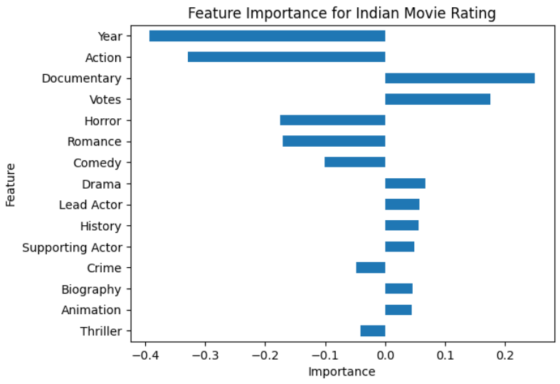

# Indian-Movie-Rating-Prediction

# Overview
A regression model that can predict Indian movie rating based on certain features.

# Data Collection

Data has already available [here](https://www.kaggle.com/datasets/adrianmcmahon/imdb-india-movies). Initially dataset contains **15K+** observations and `10 columns`

# Data Preprocessing

Dataset has `NULL` values in some features. Also contains `outliers` and `categorical features` which has to be convert to numerical values.

# Model Training

Dataset is trained using `Linear Regression` and `Ridge Regression` models. As after data processing, it becomes a high dimentional, that's why to reduce the effect of the high dimensionality problem `Ridge Regression` is used. 

# Result Analysis
As it is a regression problem, we have measure the `MAE - Mean Absolute Error` of the model. Our model should have improve the `Mean Absolute Error` from baseline MAE.
<table>
<thead>
    <tr>
      <th>Model</th>
      <th>Baseline MAE</th>
      <th>Training MAE</th>
      <th>Testing MAE</th>
    </tr>      
  </thead>
<tbody>
  <tr>
    <td>Logistic Regression</td>
    <td>1.109130</td>
    <td>0.946608</td>
    <td>0.934801</td>
  </tr>
  <tr>
    <td>Ridge Regression</td>
    <td>1.109130</td>
    <td>0.946615</td>
    <td>0.934798</td>
  </tr>
  </tbody>
</table>

We can see, our `Baseline MAE` was `1.109130`. `Logistic Regression` reduced the `Baseline` model's MASE in the `Training MAE` which becomes `0.946608` which is further reduced to `0.934801` in `Testing MAE`. On the other hand, `Training` and `Testing` MAE becomes `0.946615` and `0.934798` in `Ridge Regression`.

From the result, we can say that, both the models performance was so close. But, models could not reduce the MAE much than baseline model.

# Feature Importance

From the image we can see that, `Year` put a crucial role to predict the rating of the Indian movie.

  

